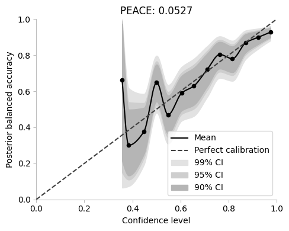

# River reliability


## Install

Install the package with:

`pip install riverreliability`

## How to use

Below, we show some basic funtionality of the package. Please look at the notebooks for more examples and documentation.

```python
np.random.seed(42)
```

We start of by generating a fake dataset for classification and splitting it in a train and test set.

```python
X, y = sklearn.datasets.make_classification(n_samples=5000, n_features=12, n_informative=3, n_classes=3)
X_train, X_test, y_train, y_test = sklearn.model_selection.train_test_split(X, y, test_size=0.2, shuffle=True)
```

For this example we use an SVM. We fit it on the training data and generate probabilities for the test set.

```python
logreg = sklearn.svm.SVC(probability=True)
logreg.fit(X_train, y_train)
y_probs = logreg.predict_proba(X_test)
```

As a sanity check we compute some performance metrics.

```python
print(f"Accuracy: {sklearn.metrics.accuracy_score(y_test, y_probs.argmax(axis=1))}")
print(f"Balanced accuracy: {sklearn.metrics.balanced_accuracy_score(y_test, y_probs.argmax(axis=1))}")
```

    Accuracy: 0.808
    Balanced accuracy: 0.8084048918146675


To get an insight into calibration we can look at the posterior reliability diagrams and the PEACE metric.

We can plot the diagrams aggregated over all classes:

```python
ax = riverreliability.plots.river_reliability_diagram(y_probs.max(axis=1), y_probs.argmax(axis=1), y_test, bins="fd")

peace_metric = riverreliability.metrics.peace(y_probs.max(axis=1), y_probs.argmax(axis=1), y_test)
ax.set_title(f"PEACE: {peace_metric:.4f}")

_ = ax.legend()
```





Or class-wise to spot miscalibrations for particular classes:

```python
import matplotlib.pyplot as plt
```

```python
axes = riverreliability.plots.class_wise_river_reliability_diagram(y_probs, y_probs.argmax(axis=1), y_test, bins=15)

peace_metric = riverreliability.metrics.class_wise_error(y_probs, y_probs.argmax(axis=1), y_test, base_error=riverreliability.metrics.peace)
_ = plt.suptitle(f"PEACE: {peace_metric:.4f}")
```


In this particular example we can see that the classifier is well calibrated.

See the notebooks directory for more examples.
